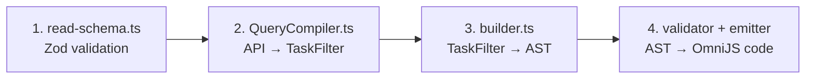

# Filter Pipeline: End-to-End Guide

How a filter travels from API input to OmniJS execution. Read this before adding or modifying any filter.

**Audience:** Developers adding new filter fields or debugging filter behavior.

---

## The Pipeline

A filter passes through 4 layers. OmniFocusReadTool connects directly to the AST pipeline — no round-trip through
QueryTasksTool.

```
API Input → Schema → QueryCompiler → TaskFilter → buildAST() → Emitter → OmniJS
```



**For date filters:** The `DATE_FILTER_DEFS` registry in `builder.ts` replaces per-field copy-paste blocks. Adding a new
date filter requires one line in the registry.

---

## Layer Details

| Layer                | File                                                          | Function                          | Responsibility                                         |
| -------------------- | ------------------------------------------------------------- | --------------------------------- | ------------------------------------------------------ |
| 1. Schema            | `src/tools/unified/schemas/read-schema.ts`                    | Zod schema validation             | Accepts/rejects API input structure                    |
| 2. Compiler          | `src/tools/unified/compilers/QueryCompiler.ts:76`             | `transformFilters()`              | Transforms API names → `TaskFilter` property names     |
| 3. AST Builder       | `src/contracts/ast/builder.ts:37`                             | `buildAST()` + `DATE_FILTER_DEFS` | Builds `FilterNode` tree from `TaskFilter`             |
| 4. Validator/Emitter | `src/contracts/ast/types.ts` + `src/contracts/ast/emitter.ts` | `KNOWN_FIELDS` + `emitOmniJS()`   | Validates field names, generates OmniJS predicate code |

### The Contract Layer

All layers communicate through one shared interface:

| File                       | Interface    | Role                                      |
| -------------------------- | ------------ | ----------------------------------------- |
| `src/contracts/filters.ts` | `TaskFilter` | Canonical filter property names and types |

### Pipeline Modules

| File                                     | Functions                                                        | Role                                                                            |
| ---------------------------------------- | ---------------------------------------------------------------- | ------------------------------------------------------------------------------- |
| `src/tools/tasks/task-query-pipeline.ts` | `augmentFilterForMode()`, `sortTasks()`, `projectFields()`, etc. | Composable pipeline functions used by both OmniFocusReadTool and QueryTasksTool |

---

## Checklist: Adding a New Date Filter Field

Adding a date filter (e.g. `completionDate`) requires **3-4 places**:

### 1. Schema (`read-schema.ts`)

Add the field to the Zod validation schema so the API accepts it:

```typescript
completionDate?: z.infer<typeof DateFilterSchema>;
```

### 2. Contract + Compiler

**a. `filters.ts`** — Add properties to `TaskFilter`:

```typescript
completionAfter?: string;
completionBefore?: string;
completionDateOperator?: DateOperator;
```

**b. `QueryCompiler.ts`** — Add a `transformDateFilter()` call:

```typescript
transformDateFilter(input.completionDate, 'completionBefore', 'completionAfter', 'completionDateOperator');
```

### 3. AST Builder (`builder.ts`)

Add one line to `DATE_FILTER_DEFS`:

```typescript
{ field: 'task.completionDate', after: 'completionAfter', before: 'completionBefore', operator: 'completionDateOperator' },
```

### 4. KNOWN_FIELDS (`types.ts`)

If the field isn't already listed, add it:

```typescript
'task.completionDate',
```

### Safety Net

The `filter-coverage.test.ts` test suite will automatically catch:

- Missing `DATE_FILTER_DEFS` entries for TaskFilter date properties
- Missing `KNOWN_FIELDS` entries for registry fields
- `buildAST()` returning trivial output for any date filter

---

## Checklist: Adding a New Non-Date Filter

For boolean, tag, text, or other filters, update:

1. **Schema** — Accept the field
2. **Contract** — Add to `TaskFilter` + `FILTER_PROPERTY_NAMES`
3. **Compiler** — Transform from API format
4. **AST Builder** — Add handling in `buildAST()`
5. **KNOWN_FIELDS** — If it uses a new AST field name

---

## Architecture History

**Before refactor (6 layers):**

```
Schema → QueryCompiler → OmniFocusReadTool.mapToAdvancedFilters() → QueryTasksTool.processAdvancedFilters() → buildAST() → Emitter
                         ^^^^^^^^^^^^^^^^^^^^^^^^^^^^^^^^^^^^^^^^^^   ^^^^^^^^^^^^^^^^^^^^^^^^^^^^^^^^^^^^^^^^^^^
                         TaskFilter → advanced format                 advanced format → TaskFilter (POINTLESS)
```

Layers 3 and 4 existed solely to convert formats back and forth. Since the unified API is the only public interface
(QueryTasksTool is never exposed to consumers), this round-trip was unnecessary.

**After refactor (4 layers):** OmniFocusReadTool calls the AST pipeline directly via `task-query-pipeline.ts` functions.
QueryTasksTool remains for CacheWarmer and internal use, but the public path bypasses it entirely.

---

## Common Failure Modes

| Symptom                                               | Likely Missing Layer   | How to Debug                            |
| ----------------------------------------------------- | ---------------------- | --------------------------------------- |
| API rejects filter input                              | Schema (layer 1)       | Check Zod schema for the field          |
| Filter accepted but ignored                           | Compiler (layer 2)     | Log `transformFilters()` output         |
| Filter appears in metadata but results are unfiltered | AST Builder (layer 3)  | Inspect generated AST with `buildAST()` |
| AST validation warns about unknown field              | KNOWN_FIELDS (layer 4) | Add field to `types.ts`                 |
| Safety net test fails                                 | Missing registry entry | Check `DATE_FILTER_DEFS` in builder.ts  |

---

## Related Documentation

- **[AST_ARCHITECTURE.md](AST_ARCHITECTURE.md)** — Deep dive on layers 3-4 (AST construction and code generation)
- **[API-COMPACT-UNIFIED.md](../api/API-COMPACT-UNIFIED.md)** — API schema reference (layer 1)
- **[ARCHITECTURE.md](ARCHITECTURE.md)** — JXA/OmniJS execution model (what runs after the emitter)
- **[PATTERNS.md](PATTERNS.md)** — Symptom-based debugging guide
