# Query Tool Modularization Guide

## Current State

The `QueryTasksTool.ts` file is currently 1548 lines long and contains all query handling logic in a single class. This makes it difficult to:

- Maintain and extend individual query modes
- Test specific query behaviors in isolation
- Understand the flow for a particular query type
- Add new query modes without affecting existing ones

## Proposed Architecture

### Strategy Pattern for Query Modes

We propose breaking down the monolithic `QueryTasksTool` into smaller, focused handler classes using the Strategy pattern:

```mermaid
graph TD
    QueryTasksTool --> QueryHandlerFactory
    QueryHandlerFactory --> CountOnlyHandler
    QueryHandlerFactory --> OverdueHandler
    QueryHandlerFactory --> UpcomingHandler
    QueryHandlerFactory --> TodaysHandler
    QueryHandlerFactory --> SearchHandler
    QueryHandlerFactory --> AvailableHandler
    QueryHandlerFactory --> BlockedHandler
    QueryHandlerFactory --> FlaggedHandler
    QueryHandlerFactory --> SmartSuggestHandler
    QueryHandlerFactory --> InboxHandler
    QueryHandlerFactory --> AllTasksHandler
    QueryHandlerFactory --> TaskByIdHandler

    BaseQueryHandler --> CountOnlyHandler
    BaseQueryHandler --> OverdueHandler
    BaseQueryHandler --> UpcomingHandler
    BaseQueryHandler --> TodaysHandler
    BaseQueryHandler --> SearchHandler
    BaseQueryHandler --> AvailableHandler
    BaseQueryHandler --> BlockedHandler
    BaseQueryHandler --> FlaggedHandler
    BaseQueryHandler --> SmartSuggestHandler
    BaseQueryHandler --> InboxHandler
    BaseQueryHandler --> AllTasksHandler
    BaseQueryHandler --> TaskByIdHandler
```



### Benefits

1. **Single Responsibility Principle**: Each handler focuses on one query mode
2. **Easier Testing**: Handlers can be tested in isolation
3. **Better Maintainability**: Changes to one query mode don't affect others
4. **Clearer Code Organization**: Related logic is grouped together
5. **Easier Extensibility**: Adding new query modes is straightforward

### Implementation Plan

#### Phase 1: Create Base Infrastructure

1. **BaseQueryHandler** - Abstract base class with common functionality:
   - Error handling
   - Task parsing
   - Field projection
   - Sorting
   - Caching utilities

2. **QueryHandlerFactory** - Factory for creating appropriate handlers:
   - Maps query modes to handler classes
   - Provides dependency injection
   - Handles fallback scenarios

#### Phase 2: Implement Specific Handlers

3. **CountOnlyHandler** - Handles count-only queries (33x faster)
4. **OverdueHandler** - Handles overdue task queries
5. **UpcomingHandler** - Handles upcoming task queries
6. **TodaysHandler** - Handles today's agenda queries
7. **SearchHandler** - Handles search queries
8. **AvailableHandler** - Handles available task queries
9. **BlockedHandler** - Handles blocked task queries
10. **FlaggedHandler** - Handles flagged task queries
11. **SmartSuggestHandler** - Handles AI-powered suggestions
12. **InboxHandler** - Handles inbox queries
13. **AllTasksHandler** - Handles general "all tasks" queries
14. **TaskByIdHandler** - Handles exact ID lookups

#### Phase 3: Update QueryTasksTool

15. **Refactor QueryTasksTool** to use the factory pattern:
    - Remove individual handler methods
    - Use factory to create appropriate handler
    - Maintain backward compatibility
    - Preserve existing API

### Example Implementation

#### BaseQueryHandler

```typescript
import { BaseTool } from '../../base.js';
import { QueryTasksArgsV2 } from '../QueryTasksTool.js';
import { TasksResponseV2 } from '../../response-types-v2.js';
import { OperationTimerV2 } from '../../../utils/response-format.js';
import { OmniFocusTask } from '../../../omnifocus/types.js';
import { ScriptResult } from '../../../omnifocus/script-result-types.js';

export abstract class BaseQueryHandler {
  constructor(
    protected tool: BaseTool,
    protected timer: OperationTimerV2
  ) {}

  abstract handle(args: QueryTasksArgsV2): Promise<TasksResponseV2>;

  // Common utility methods
  protected parseTasks(tasks: unknown[]): OmniFocusTask[] {
    // ... implementation
  }

  protected projectFields(tasks: OmniFocusTask[], selectedFields?: string[]): OmniFocusTask[] {
    // ... implementation
  }

  protected sortTasks(tasks: OmniFocusTask[], sortOptions?: any[]): OmniFocusTask[] {
    // ... implementation
  }

  protected handleScriptError(result: ScriptResult<unknown>, operation: string): TasksResponseV2 {
    // ... implementation
  }

  protected createErrorResponse(
    errorType: string,
    message: string,
    suggestion: string,
    details?: unknown,
    timer?: OperationTimerV2
  ): TasksResponseV2 {
    // ... implementation
  }
}
```

#### CountOnlyHandler Example

```typescript
import { BaseQueryHandler } from './base-query-handler.js';
import { QueryTasksArgsV2 } from '../QueryTasksTool.js';
import { TasksResponseV2 } from '../../response-types-v2.js';
import { GET_TASK_COUNT_SCRIPT } from '../../../omnifocus/scripts/tasks.js';

export class CountOnlyHandler extends BaseQueryHandler {
  async handle(args: QueryTasksArgsV2): Promise<TasksResponseV2> {
    // Process filters
    const filter = this.processAdvancedFilters(args);

    // Execute optimized count-only script
    const script = this.tool.omniAutomation.buildScript(GET_TASK_COUNT_SCRIPT, { filter });
    const result = await this.tool.execJson(script);

    if (!result.success) {
      return this.handleScriptError(result, 'count_only');
    }

    // Extract count from result
    const data = result.data as { count?: number; warning?: string };
    const count = data.count ?? 0;

    // Return count in standardized format
    return {
      success: true,
      tasks: [],
      metadata: {
        ...this.timer.toMetadata(),
        from_cache: false,
        mode: args.mode || 'count_only',
        count_only: true,
        total_count: count,
        filters_applied: filter,
        optimization: 'count_only_script_33x_faster',
        warning: data.warning,
      },
    };
  }

  private processAdvancedFilters(args: QueryTasksArgsV2): Record<string, unknown> {
    // ... implementation
  }
}
```

#### QueryHandlerFactory Example

```typescript
import { BaseQueryHandler } from './base-query-handler.js';
import { CountOnlyHandler } from './count-only-handler.js';
import { OverdueHandler } from './overdue-handler.js';
import { QueryTasksArgsV2 } from '../QueryTasksTool.js';
import { TasksResponseV2 } from '../../response-types-v2.js';
import { BaseTool } from '../../base.js';
import { OperationTimerV2 } from '../../../utils/response-format.js';

export class QueryHandlerFactory {
  constructor(
    private tool: BaseTool,
    private timer: OperationTimerV2
  ) {}

  createHandler(mode: string, args: QueryTasksArgsV2): BaseQueryHandler {
    switch (mode) {
      case 'count_only':
        return new CountOnlyHandler(this.tool, this.timer);
      case 'overdue':
        return new OverdueHandler(this.tool, this.timer);
      // ... other cases
      default:
        return new CountOnlyHandler(this.tool, this.timer); // fallback
    }
  }

  async executeHandler(mode: string, args: QueryTasksArgsV2): Promise<TasksResponseV2> {
    const handler = this.createHandler(mode, args);
    return handler.handle(args);
  }
}
```

#### Updated QueryTasksTool

```typescript
// In executeValidated method:
async executeValidated(args: QueryTasksArgsV2): Promise<TasksResponseV2> {
  const timer = new OperationTimerV2();

  try {
    // Validate and normalize inputs
    const normalizedArgs = this.normalizeInputs(args);

    // Use the new modular query handler approach
    const factory = new QueryHandlerFactory(this, timer);

    // Special case: Count-only queries
    if (normalizedArgs.countOnly) {
      return factory.executeHandler('count_only', normalizedArgs);
    }

    // Special case: ID filtering
    if (normalizedArgs.id) {
      return factory.executeHandler('id_lookup', normalizedArgs);
    }

    // Route to appropriate handler based on mode
    return factory.executeHandler(normalizedArgs.mode, normalizedArgs);

  } catch (error) {
    // ... error handling
  }
}
```

### Migration Strategy

1. **Incremental Implementation**: Implement handlers one at a time
2. **Backward Compatibility**: Keep existing methods until all handlers are implemented
3. **Comprehensive Testing**: Test each handler thoroughly before moving to the next
4. **Documentation Updates**: Update API documentation as handlers are added

### File Structure

```
src/tools/tasks/
├── QueryTasksTool.ts              # Main tool (refactored to use factory)
├── query-types.ts                # Type exports for handlers
├── query-modes/
│   ├── base-query-handler.ts     # Base handler with common functionality
│   ├── query-handler-factory.ts  # Factory for creating handlers
│   ├── count-only-handler.ts     # Count-only query handler
│   ├── overdue-handler.ts        # Overdue tasks handler
│   ├── upcoming-handler.ts       # Upcoming tasks handler
│   ├── todays-handler.ts         # Today's agenda handler
│   ├── search-handler.ts         # Search query handler
│   ├── available-handler.ts      # Available tasks handler
│   ├── blocked-handler.ts        # Blocked tasks handler
│   ├── flagged-handler.ts        # Flagged tasks handler
│   ├── smart-suggest-handler.ts  # Smart suggestions handler
│   ├── inbox-handler.ts          # Inbox tasks handler
│   ├── all-tasks-handler.ts      # All tasks handler
│   └── task-by-id-handler.ts     # Exact ID lookup handler
└── filter-types.ts              # Filter type definitions
```

### Testing Approach

Each handler should have its own test file following the existing pattern:

```typescript
// tests/unit/tools/tasks/query-modes/count-only-handler.test.ts
describe('CountOnlyHandler', () => {
  let handler: CountOnlyHandler;
  let mockTool: any;
  let mockTimer: any;

  beforeEach(() => {
    mockTool = {
      omniAutomation: {
        buildScript: vi.fn(),
      },
      execJson: vi.fn(),
      cache: {
        get: vi.fn(),
        set: vi.fn(),
      },
    };

    mockTimer = {
      toMetadata: vi.fn().mockReturnValue({}),
    };

    handler = new CountOnlyHandler(mockTool, mockTimer);
  });

  describe('handle', () => {
    it('should execute count-only script and return count', async () => {
      // ... test implementation
    });

    it('should handle script errors gracefully', async () => {
      // ... test implementation
    });
  });
});
```

### Benefits Summary

1. **Reduced File Size**: Break down 1548-line file into manageable chunks
2. **Improved Maintainability**: Each handler is self-contained and focused
3. **Better Testability**: Handlers can be tested in isolation with focused test cases
4. **Easier Debugging**: Issues can be traced to specific handlers
5. **Clearer Architecture**: Strategy pattern makes the code more understandable
6. **Future-Proof**: Easy to add new query modes without affecting existing code

### Recommendations

1. **Start with Simple Handlers**: Begin with `CountOnlyHandler` and `OverdueHandler`
2. **Preserve Existing Behavior**: Ensure all handlers maintain exact same behavior as original
3. **Comprehensive Testing**: Test each handler thoroughly before moving to production
4. **Document Each Handler**: Add clear documentation for each handler's purpose and behavior
5. **Monitor Performance**: Ensure the modular approach doesn't introduce performance overhead

This modularization approach will significantly improve the codebase's maintainability while preserving all existing functionality and performance characteristics.